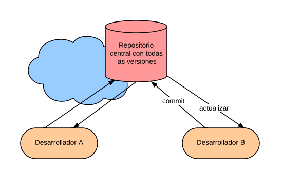
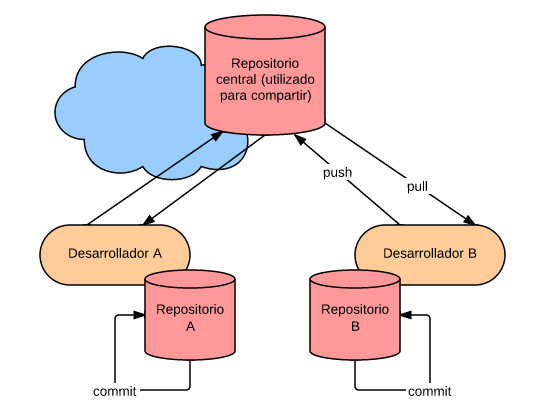
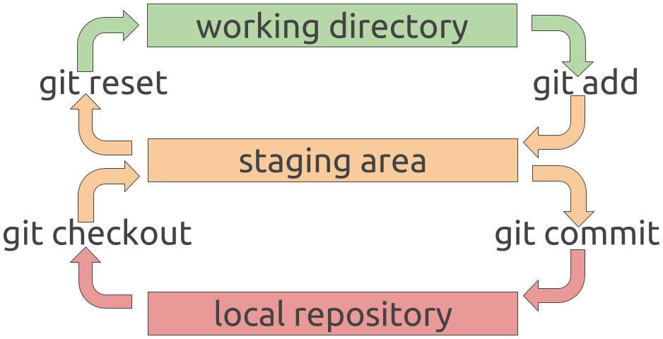
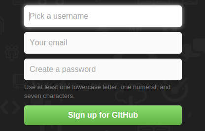
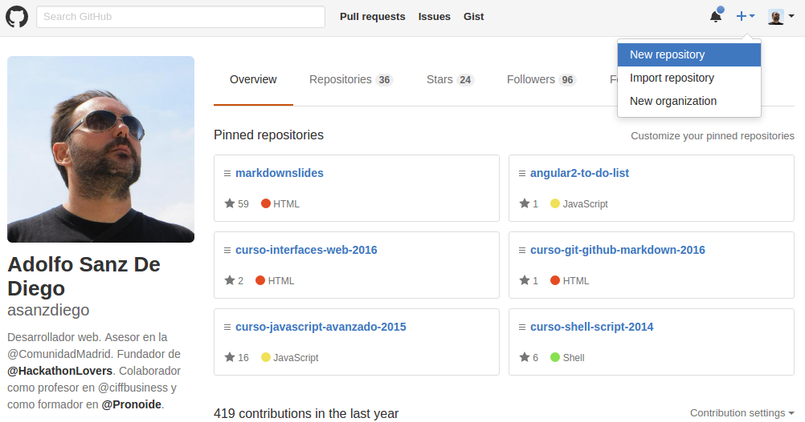
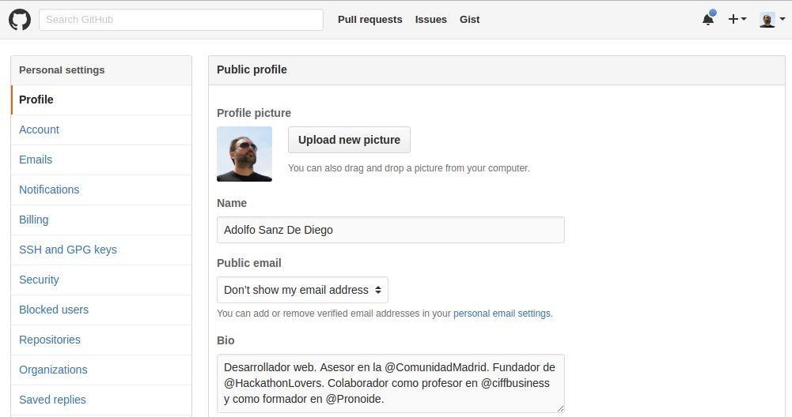
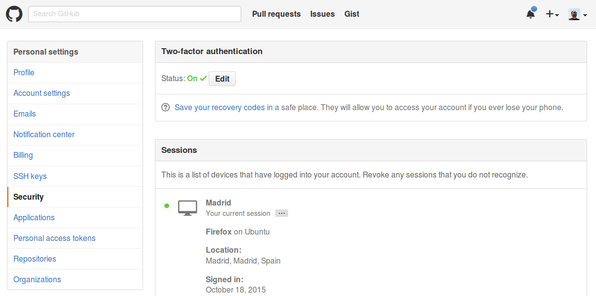
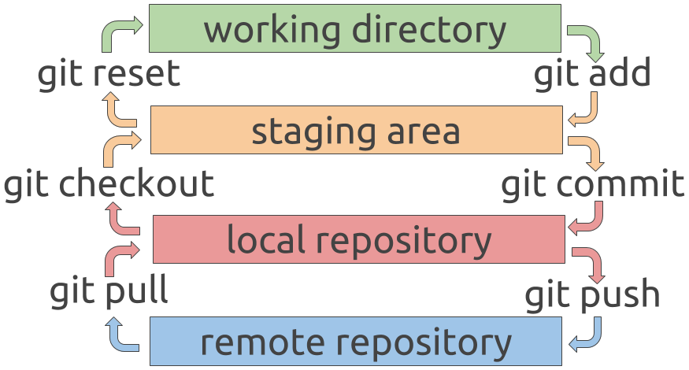
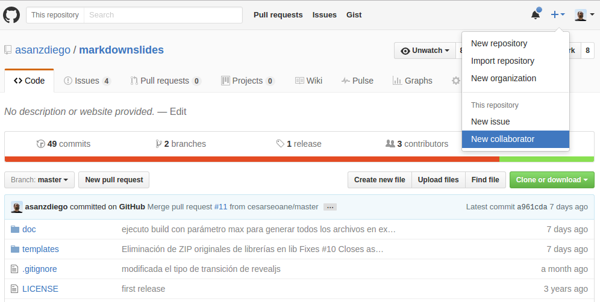
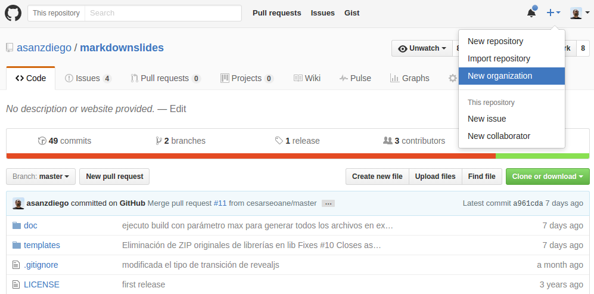

% Git, GitHub y Markdown
% Adolfo Sanz De Diego
% Octubre 2017

# Acerca de

## Autor

- **Adolfo Sanz De Diego**
    - Blog: [asanzdiego.blogspot.com.es](http://asanzdiego.blogspot.com.es/)
    - Correo: [asanzdiego@gmail.com](mailto:asanzdiego@gmail.com)
    - GitHub: [github.com/asanzdiego](http://github.com/asanzdiego)
    - Twitter: [twitter.com/asanzdiego](http://twitter.com/asanzdiego)
    - LinkedIn: [in/asanzdiego](http://www.linkedin.com/in/asanzdiego)
    - SlideShare: [slideshare.net/asanzdiego](http://www.slideshare.net/asanzdiego/)

## Licencia

- **Este obra está bajo una licencia:**
    - [Creative Commons Reconocimiento-CompartirIgual 3.0](http://creativecommons.org/licenses/by-sa/3.0/es/)

## Fuente

- Las slides y sus fuentes las podéis encontrar en:
    - <https://github.com/asanzdiego/curso-git-github-markdown-2016>

# Introducción

## Enlaces imprescindibles

- Pro GIT (sobre todo temas 1, 2, 3 y 6):
    - <https://git-scm.com/book/es/v2>

- Página oficial de Git:
    - <https://git-scm.com/>

- Página oficial de GitHub:
    - <https://github.com/>

- Chuleta de la sintaxis de Markdown:
    - <http://warpedvisions.org/projects/markdown-cheat-sheet>

## Otros enlaces de interés

- Aprender GIT... y de camino GitHub:
    - <https://github.com/oslugr/curso-git>

- Minitutorial de GIT:
    - <https://try.github.io/>

- Tutorial de GIT de codecademy;
    - <https://www.codecademy.com/learn/learn-git>

- How GitHub Uses GitHub to Build GitHub:
    - <http://zachholman.com/talk/how-github-uses-github-to-build-github/>

# Uso básico de Git

##  Sistema Control de Versiones

> "Sistema que registra los cambios realizados sobre un archivo o
conjunto de archivos a lo largo del tiempo, de modo que
puedas recuperar versiones específicas más adelante."

- <https://git-scm.com/book/es/v2/Empezando-Acerca-del-control-de-versiones>

## VCS Locales

- **Lo más simple**: hacer copias de directorios.

- Aparecieron **BD en local** que guardan el registro de los cambios realizados a los archivos.

##  VCS Centralizados

- Un **servidor central** que guarda los cambios.

{ width=50% text-align=center }

##  Pros y Contras VCS Centralizados

- **Pros**: más colaborativo que el local.

- **Contras**: dependes de un servidor central.

## VCS Distribuidos

- Cada cliente **no solo descarga la última copia, sino todo el repositorio**.

{ width=50% text-align=center }

## Ventajes VCS Distribuidos

- Puedes seguir trabajando aunque el repositorio remoto esté caido.
    - **más autonomía**

- La información está más replicada.
    - **menos vulnerable**

- Permite pruebas en local y subir solo lo relevante.
    - **más limpieza**

##  Características de Git

- Creado por **Linux Torvalds**, líder del equipo del kernel Linux.

- Objetivos cuando se creó:
    - **Rápido**
    - **Sencillo**
    - **Multi rama**
    - **Distribuido**
    - **Grandes proyectos**

##  Instalación

- Windows: <https://git-scm.com/download/win>

- Mac: <https://git-scm.com/download/mac>

- Linux: <https://git-scm.com/download/linux>

## Configuración inicial

~~~
git config --global user.name "Nombre que quieras mostrar"
~~~

~~~
git config --global user.email "correo@electronico.es"
~~~

## GUIs

- <https://git-scm.com/downloads/guis>

## Iinicializar un reposiorio

- Crea el **subdirectorio .git** con archivos de git para gestionar el repositorio.

~~~
git init
~~~

## El área de staging

{ width=50% text-align=center }

##  Ver el estado de los archivos

- Importante saber el **estado** de los archivos.

~~~
git status
~~~

##  Ver las diferencias

- Podemos ver las **diferencias** entre el área de staging y el área de trabajo.

~~~
git diff
~~~

##  Añadir archivos

- Podemos **añadir** los cambios de un fichero (o varios) al área de staging (desde el área de trabajo).

~~~
git add nombre-del-fichero
~~~

~~~
git add *.extension
~~~

~~~
git add -A
~~~

## Borrar archivos

- Podemos **borrar archivos** del área de staging (también lo borrará del área de trabajo)

~~~
git rm nombre-del-fichero
~~~

## Mover/renombrar archivos

- Podemos **mover/renombrar archivos** en el área de staging (también lo hará en el área de trabajo)

~~~
git mv antiguo-nombre-del-fichero nuevo-nombre-del-fichero
~~~

##  Resetar archivos

- Para **resetear** los cambios de un fichero (o varios) al area de trabajo (desde el area de staging).

~~~
git reset nombre-del-fichero
~~~

##  Grabar los cambios

- Para **grabar** los cambios realizados al repositorio (desde el área de staging).

~~~
git commit -m "mensaje corto descriptivo con los cambios"
~~~

##  Deshacer los cambios

- Para **deshacer** los cambios de un fichero (o varios) al area de staging (desde el repositorio).

~~~
git checkout nombre-del-fichero
~~~

## Listado de cambios

- Para ver el **listado de cambios** realizados en el repositorio.

~~~
git log
~~~

## Alias

- Podemos crear **alias**.

~~~
git config --global alias.list 'log --oneline --decorate --graph --all'
~~~

## Ignorar archivos

- Podemos ignorar archivos añadiendolos al fichero **.gitignore**.

## Creando etiquetas

- Existen etiquetas **ligeras**, y etiquetas **anotadas** (iguales pero estas con más información)

~~~
git tag nombre-etiqueta-lijera
~~~

~~~
git tag -a nombre-etiqueta-anotada -m "mensaje que acompaña a la etiqueta"
~~~

## Etiquetas tardías

- Se puede crear una etiqueta **conociendo el hash del commit** (verlo con git log).

~~~
git tag -a nombre-etiqueta-anotada -m "mensaje que acompaña a la etiqueta" hash-del-commit
~~~

## Ver una etiqueta

- Podemos **ver información concreta de una etiqueta**.

~~~
git show nombre-etiqueta
~~~

## Sacar una etiqueta

- No podemos sacar una etiqueta, pero podemos **colocar en nuestro directorio
de trabajo una versión que coincida con alguna etiqueta, creando una rama nueva**:

~~~
git checkout -b nombre-rama nombre-etiqueta
~~~

# Uso básico de GitHub

##  Características de GitHub

- **Plataforma de desarrollo colaborativo**, que utiliza Git.

- Los **repositorios son públicos**, salvo con cuenta de pago.

- Tiene facetas de **red social** (perfil público, seguidores, estrellas, etc.)

- Nos permite **gestionar organizaciones y equipos**.

- **Gestión de proyectos** (wiki, releases, incidencias, gráficos, etc.)

- **Servidor web**.

##  Crear cuenta

{ width=50% text-align=center }

##  Crear repositorio

{ width=50% text-align=center }

##  Configurar claves (I)

- Nos permite gestionar repositorios **mediante SSH** sin tener que estar poniendo
siempre nuestra constraseña.

- Se genera una **clave privada** que se guarde en nuestro ordenador y
una **clave pública** que es la que tenemos que guardar en nuestra cuenta.

##  Configurar claves (II)

- La podemos usar pues **solo con un ordenador**.

- Instrucciones:

    - <https://help.github.com/articles/generating-ssh-keys/>

## Cambiar avatar

- View profile and more > Settings > Profile

{ width=50% text-align=center }

## Doble factor de autentificación

- View profile and more > Settings > Security

{ width=50% text-align=center }

##  Uso social

- Características sociales:
    - Seguir a gente.
    - Seguir proyectos (watch).
    - Premiar proyectos (start).
    - Forquear proyectos (fork).
    - Crear organizaciones.

# Uso avanzado de Git

## Conectar un repositorio remoto

- Podemos **conectar uno o varios reposiorios remotos** a nuestro repositorio.

~~~
git remote add alias-repositorio-remoto url-repositorio-remoto
~~~

## Renombrar un repositorio remoto

- Podemos **renombrar el alias de un reposiorio remoto**.

~~~
git remote rename antiguo-alias nuevo-alias
~~~

## Desconectar un repositorio remoto

- Podemos **desconectar un reposiorio remoto**.

~~~
git remote remove alias-repositorio-remoto
~~~

## Ver los repositorios remotos

- Podemos **ver los repositorios remotos conectados y los permisos que tenemos**.

~~~
git remote -v
~~~

## Descargar cambios remotos

- Podemos **descargar los cambios remotos sin modificar nuestro repositorio local**.

~~~
git fetch alias-repositorio-remoto
~~~

## Descargar y combinar

- Podemos **descargar y combinar los cambios remotos** con los de tu repositorio local.

~~~
git pull alias-repositorio-remoto nombre-rama-repositorio-remoto
~~~

## Enviar datos

- Podemos **enviar datos al reposiorio remoto** (solo si está up-to-date).

~~~
git push alias-repositorio-remoto nombre-rama-repositorio-remoto
~~~

## Repos y ramas

- Normalmente:

~~~
git pull/push origin master
~~~

## Enviar datos (III)

- Si queremos subir los tags:

~~~
git push --tag origin master
~~~

##  Clonar repositorios

- Clonar es como:
    - hacer un init
    - luego un remote add
    - luego un fetch con alias=origin
    - dejando las ramas remota y local en master

~~~
git clone url-repositorio-remoto
~~~

## Inspeccionar repositorio remoto

- Podemos ver **información de un remoto particular, y como están configurados pull y push**.

~~~
git remote show alias-repositorio-remoto
~~~

## Resumen áreas

{ width=50% text-align=center }

## Crear una rama

- Podemos crear ramas que son **apuntadores que podemos mover por los distintos snapshots**.

- Solo la creamos, no nos situamos en ella.

~~~
git branch nombre-rama
~~~

## Cambiar de rama

- El HEAD es el apuntador que usa GIT para saber en que rama estás.

- Cuando cambiamos de rama GIT **cambia el HEAD y los ficheros de tu área de trabajo**.

~~~
git checkout nombre-rama
~~~

## Crear y cambiar de rama

- Podemos **crear y cambiar de rama** con un mismo comando.

~~~
git checkout -b nombre-rama
~~~

## Ver las ramas y el HEAD

- Podemos **ver las ramas y donde apunta el HEAD**.

~~~
git log --oneline --decorate --graph --all
~~~

~~~
git branch -v
~~~

## Fusionar ramas

- GIT es **muy potente** con la fusión de ramas.

~~~
git merge nombre-rama
~~~

## Solucionar conflictos

- Si al hacer un merge existan conflictos **GIT los apunta en los propios ficheros**.

~~~
<<<<<<< HEAD:index.html

contact : email.support@github.com

=======

please contact us at support@github.com

>>>>>>> issue:index.html
~~~

## Borrar ramas

- Una vez fusionado la rama en el master, **conviene borrarla** (solo nos deja si está fusionada).

~~~
git branch -d nombre-rama
~~~

## Listado de ramas por estado

- Podemos saber **que ramas están fusionada y cuales no**.

~~~
git branch --merged
~~~

~~~
git branch --no-merged
~~~

## Sincronizar rama remota

- Igual que sincronizamos la rama master remota, podemos **sincronizar otras ramas remotas**.

~~~
git checkout -b nombre-rama-local alias-repositorio-remoto/nombre-rama-remota
~~~

~~~
git checkout --track alias-repositorio-remoto/nombre-rama-remota
~~~

## Asignar rama remota

- Podemos **asignar el área de trabajo a una rama remota**.

~~~
git checkout -u alias-repositorio-remoto/nombre-rama-remota
~~~

## Listado de todas las ramas

- Podemos listar no solo las ramas locales, sino **también las remotas**.

~~~
git branch -vv
~~~

## Eliminar rama remota

- Podemos **eliminar las ramas remotas**.

~~~
git push alias-repositorio-remoto --delete nombre-rama-remota
~~~

# Uso avanzado de GitHub

## Añadir colaboradores

- Podemos **dar permisos de push** a quien queramos.

{ width=50% text-align=center }

## Crear organizaciones

- Podemos **crear organizaciones**.

{ width=50% text-align=center }

## Gestionar organizaciones

- Dentro de las organizaciones podemos **crear equipos** y/o trabajar con colaboradores externos.

- El **nivel de permisos se gestiona a nivel de equipo**.

- Las personas tendrán los permisos de los equipos a los que pertenezca.

- Los permisos se otorgan a cada repositorio.

## Forkear proyectos

- Para **participar en un proyecto sin permisos de escritura**, puedes forkearlo.

- Consiste en crear una copia completa del repositorio bajo tu control:
 se encontrará **en tu cuenta** y podrás escribir en él sin limitaciones.

## Pull-requests (I)

- Para **enviar propuestas de mejora**.

- Se usa mucho para proyectos que no son tuyos y en donde te gustaría colaborar.

- También se usa dentro de equipos para gestionar proyectos grandes.

## Pull-requests (II)

1. Crear un fork de proyecto.
1. Clonar nuestro fork en nuestro equipo.
1. Crear una rama que sea descriptiva.
1. Realizar nuestros cambios.
1. Comprobar los cambios.
1. Enviar nuestra nueva rama de vuelta a nuestro fork.

## Pull-requests (III)

1. Abrir un Pull Request en GitHub.
1. Participa en la discusión asociada.
1. Opcionalmente, se realizan nuevos commits.
1. El propietario del proyecto original cierra el Pull Request
    - bien fusionando la rama con tus cambios
    - o bien rechazándolos.

## Issues y Wikis

- Todos los repositorios de GitHub tienen asociados:
    - un gestor de incidencias (issues)
    - una wiki para documentar

## GitHub pages

- Podemos tener **servidor web en los repositorios simplemente configurandolo**:

- Ver : <https://pages.github.com/>

## Fichero README.md

- Nos **lo muestra renderizado** en la página del reposiorio.

## Webhooks & services

- Para que GitHub pueda **interactúar con sistemas externos**.

- Los servicios están ya medio configurados.

- Si necesitas algo más especifico lo tienes que hacer con webhooks,
que lo que hace GitHub es hacer un POST a la URL que indiques
cuando se lance algún evento (push, pull request, fork, etc.)

# Markdown

##  ¿Qué es Markdown?

> "Es un lenguaje de marcado ligero que trata de conseguir la máxima
legibilidad y 'publicabilidad' usando texto plano."

- <https://es.wikipedia.org/wiki/Markdown>

##  Características principales

- Texto plano
- Sintaxis sencilla
- Legibilidad
- Publicabilidad
- Exportabiliad

## Mardownslides

- <https://github.com/asanzdiego/markdownslides>

## Chuleta de Markdown:

- <http://warpedvisions.org/projects/markdown-cheat-sheet>

##  Editor online

- <https://jbt.github.io/markdown-editor/>

##  Encabezados (I)

- `<h1>, <h2>, <h3>`

~~~
# Encabezado de primer nivel

## Encabezado de segundo nivel

### Encabezado de tercer nivel
~~~

##  Encabezados (II)

- Equivalente a lo anterior.

~~~
Encabezado de primer nivel
==========================

Encabezado de segundo nivel
---------------------------

### Encabezado de tercer nivel ###
~~~

##  Listas no numeradas

- No enumeradas:
    - se puede usar el menos
    * se puede usar el asterísico
    + se puede usar el más

~~~
- se puede usar el menos
* se puede usar el asterísico
+ se puede usar el más
~~~

##  Listas numeradas

- Enumeradas:
    1. Primer elemento
    1. Segundo elemento
    1. Tercer elemento

~~~
1. Primer elemento
1. Segundo elemento
1. Tercer elemento
~~~

##  Formato (negrita, cursiva, tachado)

- Texto en cursiva con *un asterisco* o con _un guión bajo_.
- Texto en negrita con **dos asteriscos** o con __dos guiones bajos__.
- Texto tachado con ~~dos virgulillas~~.

~~~
- Texto negrita con **dos asteriscos** o con __dos guiones bajos__.
- Texto cursiva con *un asterisco* o con _un guión bajo_.
- Texto tachado con ~~dos virgulillas~~.
~~~

## tablas

| Header | Header | Right  |
| ------ | ------ | -----: |
|  Cell  |  Cell  |   $10  |
|  Cell  |  Cell  |   $20  |

~~~
| Header | Header | Right  |
| ------ | ------ | -----: |
|  Cell  |  Cell  |   $10  |
|  Cell  |  Cell  |   $20  |
~~~

## Citas

> "No hay camino hacia el Software Libre,
el Software Libre es el camino"

~~~
> "No hay camino hacia el Software Libre,
el Software Libre es el camino"
~~~

## Código

~~~R
require(maps) # activación de librería
require(mapproj) # se usará para projection="polyconic"
  # Cargar los datos
  # unemp incluye datos para condados de los Estados Unidos continentales.
data(unemp) # Datos de desempleo
data(county.fips) # mapa de los condados
~~~

~~~
require(maps) # activación de librería
require(mapproj) # se usará para projection="polyconic"
  # Cargar los datos
  # unemp incluye datos para condados de los Estados Unidos continentales.
data(unemp) # Datos de desempleo
data(county.fips) # mapa de los condados
~~~

## Enlaces

- [Enlace con texto](https://github.com/asanzdiego/curso-git-github-markdown-2015)

- Enlace sencillo:
    -<https://github.com/asanzdiego/curso-git-github-markdown-2015>

~~~
- [Enlace con texto](https://github.com/asanzdiego/curso-git-github-markdown-2015)

- Enlace sencillo:
    -<https://github.com/asanzdiego/curso-git-github-markdown-2015>
~~~

## Imágenes

- Este obra está bajo una licencia:

{ width=50% text-align=center }

~~~
- Este obra está bajo una licencia:

{ width=50% text-align=center }

~~~
