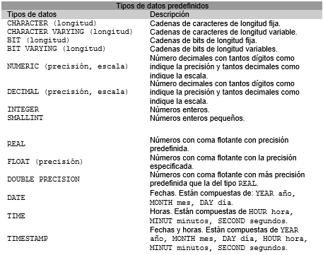
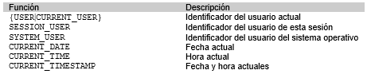
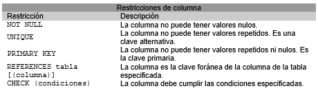
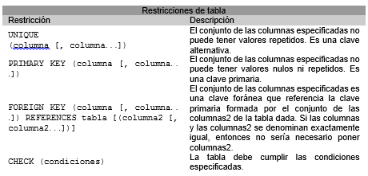
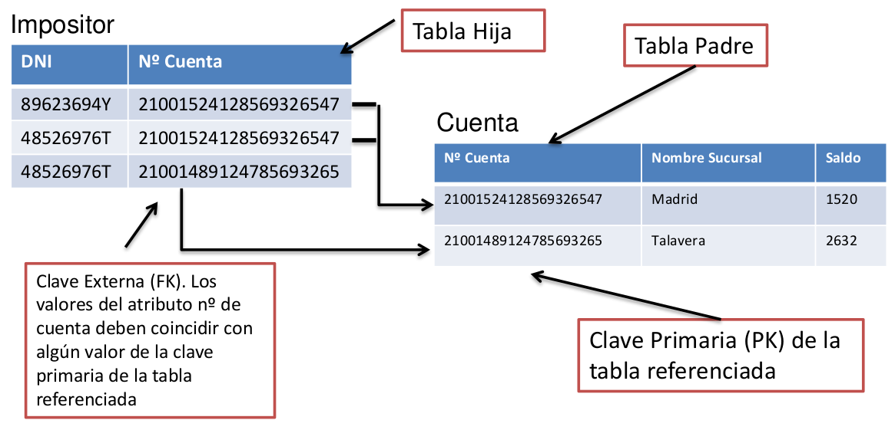
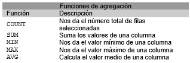
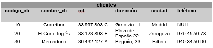
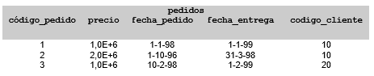
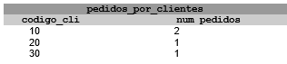

% SQL
% Adolfo Sanz De Diego
% Octubre 2017

# Acerca de

## Autor

- **Adolfo Sanz De Diego**
    - Blog: [asanzdiego.blogspot.com.es](http://asanzdiego.blogspot.com.es/)
    - Correo: [asanzdiego@gmail.com](mailto:asanzdiego@gmail.com)
    - GitHub: [github.com/asanzdiego](http://github.com/asanzdiego)
    - Twitter: [twitter.com/asanzdiego](http://twitter.com/asanzdiego)
    - LinkedIn: [in/asanzdiego](http://www.linkedin.com/in/asanzdiego)
    - SlideShare: [slideshare.net/asanzdiego](http://www.slideshare.net/asanzdiego/)

## Licencia

- **Copyright:**
    - Antonio Sarasa Cabezuelo <[antoniosarasa@campusciff.net](mailto:antoniosarasa@campusciff.net)>

## Fuente

- Las slides y sus fuentes las podéis encontrar en:
    - <https://github.com/asanzdiego/curso-intro-linux-web-sql-2016>

# MySQL

## ¿Qué es?

- **MySQL** es un sistema de gestión de bases de datos relacional.

- Tiene una Licencia GPL (Software Libre)

## Instalación

- En Ubuntu: (acordaros de poner password de root y no olvidarla)

~~~
sudo apt install mysql-server
~~~

# MySQLWorkbench

## ¿Qué es?

- Es una **interfaz gráfica** para el manejo de MySQL.

- Tiene una Licencia GPL (Software Libre)

## Instalación

- En Ubuntu:

~~~
sudo apt install mysql-workbench
~~~

# Creación de tablas

## CREATE TABLE

- Para crear una tabla se utiliza la sentencia **CREATE TABLE**:

~~~{.sql}
CREATE TABLE nombre_tabla
( definicion_columna[, definicion_columna...]
[, restricciones_tabla]);
~~~

## Consideraciones

- La definición de una columna consta del nombre
de la columna, un tipo de datos predefinido, un
conjunto de definiciones por defecto y
restricciones de columna.

## Tipos de datos

- Los **principales tipos de datos** predefinidos en
SQL que pueden asociarse a una columna son:

{ width=50% text-align=center }

## Valores por defecto

- Se pueden especificar valores por defecto
mediante la sentencia:

~~~{.sql}
DEFAULT (literal|función|NULL)
~~~

    - Si se elige la **opción NULL**, entonces indica que la
columna debe admitir valores nulos.
    - Si se elige la **opción literal**, entonces indica que la
columna tomará el valor indicado por el literal.
    - Si se elige la **opción función**, se indicará alguna de las
funciones siguientes.

## Funciones

{ width=50% text-align=center }

## Restricciones de columna

- Se pueden definir **restricciones sobre las
columnas** de la siguiente forma:

~~~{.sql}
CONSTRAINT nombre_restricción [CHECK(condiciones)]
~~~

## Lista restricciones columna

{ width=50% text-align=center }

## Restricciones tabla

- Se pueden especificar **restricciones sobre toda la tabla**:

{ width=50% text-align=center }

## Ejemplo 1

~~~{.sql}
CREATE TABLE sucursal
(nombre_sucursal VARCHAR2(15) CONSTRAINT suc_PK PRIMARY KEY,
ciudad CHAR(20) NOT NULL CONSTRAINT cl_UK UNIQUE,
activos NUMBER(12,2) default 0);
~~~

## Ejemplo 2

~~~{.sql}
CREATE TABLE cliente
(dni VARCHAR2(9) NOT NULL,
nombre_cliente CHAR(35) NOT NULL,
domicilio CHAR(50) NOT NULL,
CONSTRAINT cl_PK PRIMARY KEY (dni));
~~~

## Ejemplo 3

~~~{.sql}
CREATE TABLE cuenta
(numero_cuenta CHAR (20) PRIMARY KEY,
nombre_sucursal char(15)
REFERENCES sucursal,
saldo NUMBER(12,2) default 100,
CONSTRAINT imp_minimo CHECK(saldo >=100))
~~~

## Ejemplo 4

~~~{.sql}
CREATE TABLE impositor
(dni CHAR(9) CONSTRAINT imp_dni_FK
REFERENCES cliente,
numero_cuenta CHAR(20) NOT NULL,
CONSTRAINT imp_PK PRIMARY KEY (dni, numero_cuenta),
CONSTRAINT imp_ct_FK FOREIGN KEY (numero_cuenta) REFERENCES cuenta)
~~~

## PK y FK

{ width=50% text-align=center }

## Politicas de borrado

- Cuando se define una clave foránea se puede
especificar las políticas de borrado y modificación
de filas que tienen una clave primaria
referenciada por claves foráneas de la siguiente forma:

~~~{.sql}
FOREIGN KEY clave_secundaria REFERENCES nombre_tabla [(clave_primaria)]
[ON DELETE {NO ACTION | CASCADE | SET DEFAULT | SET NULL}]
[ON UPDATE {NO ACTION | CASCADE | SET DEFAULT | SET NULL}]
~~~

- **NO ACTION** impide realizar alguna acción sobre un
valor de clave primaria si en la tabla referenciada hay
una valor de clave foránea relacionado.
- **CASCADE** representa la actualización en cascada.
Borra o actualiza el registro en la tabla referenciada y
en la tabla actual.
- **SET NULL** borra o actualiza el registro en la tabla
referenciada y establece en NULL la/s columna/s de
clave foránea en la tabla actual.
- **SET DEFAULT** indica que se ponga el valor especificado
por defecto.

## Ejemplo 3 actualizado

~~~{.sql}
CREATE TABLE cuenta
(numero_cuenta CHAR (20) PRIMARY KEY,
nombre_sucursal char(15)
CONSTRAINT ct_FK REFERENCES sucursal on delete set null,
saldo NUMBER(12,2) default 100,
CONSTRAINT imp_minimo CHECK(saldo >=100))
~~~

## Ejemplo 4 actualizado

~~~{.sql}
CREATE TABLE impositor
(dni CHAR(9) CONSTRAINT imp_dni_FK
REFERENCES cliente on delete cascade,
numero_cuenta CHAR(20),
CONSTRAINT imp_PK PRIMARY KEY (dni, numero_cuenta),
CONSTRAINT imp_ct_FK FOREIGN KEY (numero_cuenta)
REFERENCES cuenta on delete cascade)
~~~

## ALTER TABLE

- Para modificar una tabla se utiliza **ALTER TABLE**:

~~~{.sql}
ALTER TABLE nombre_tabla
{accion_modificar_columna|accion_modificar_restriccion_tabla};
~~~

## Añadir columna

- **Añadir columna** a una tabla.

~~~{.sql}
ALTER TABLE nombre_tabla
ADD nombre_columna TIPO [propiedades]
~~~

## Eliminar columna

- **Eliminar columna** de una tabla.

~~~{.sql}
ALTER TABLE nombre_tabla
DROP COLUMN nombre_columna
~~~

## Modificar columna

- **Modificar columna** de una tabla.

~~~{.sql}
ALTER TABLE nombre_tabla
MODIFY (nombre_columna TIPO [propiedades])
~~~

## Renombrar columna

- **Renombrar columna** de una tabla.

~~~{.sql}
ALTER TABLE nombre_tabla
RENAME COLUMN nombre_columna_1 TO nombre_columna_2
~~~

## Añadir restricción

- **Añadir restricciones** a una tabla.

~~~{.sql}
ALTER TABLE nombre_tabla
ADD CONSTRAINT nombre_restriccion TIPO (columnas)
~~~

## Eliminar restricción

- **Eliminar restricciones** de una tabla.

~~~{.sql}
ALTER TABLE nombre_tabla
DROP {PRIMARY KEY|UNIQUE(columnas)|CONSTRAINT nombre_restriccion [CASCADE]}
~~~

- La opción CASCADE hace que se eliminen las restricciones de integridad
que dependen de la eliminada.

## Desactivar restricciones

- **Desactivar restricciones** a una tabla.

~~~{.sql}
ALTER TABLE nombre_tabla
DISABLE CONSTRAINT nombre_restriccion [CASCADE]
~~~

## Activar restricciones

- **Activar restricciones** a una tabla.

~~~{.sql}
ALTER TABLE nombre_tabla
ENABLE CONSTRAINT nombre_restriccion
~~~

## Ejemplo modificación

~~~{.sql}
ALTER TABLE cuenta ADD comision NUMBER(4,2);
ALTER TABLE cuenta ADD fecha_apertura DATE;
ALTER TABLE cuenta DROP COLUMN nombre_sucursal;
ALTER TABLE cuenta MODIFY comision DEFAULT 1.5;
ALTER TABLE cliente MODIFY nombre_cliente NULL;
ALTER TABLE sucursal ADD CONSTRAINT cd_UK UNIQUE(ciudad);
~~~

## Borrado de tablas

- Para **borrar una tabla** se utiliza la sentencia:

~~~{.sql}
DROP TABLE nombre_tabla {RESTRICT|CASCADE}
~~~

- **RESTRICT** indica que la tabla no se borrará si está
referenciada.

- **CASCADE** indica que todo lo que referencie a la tabla se
borrará con ésta.

## Descripción de tabla

- Para ver la **descripción de una tabla** se utiliza la sentencia:

~~~{.sql}
DESCRIBE nombre_tabla
~~~

## Renombrar tabla

- Para **renombrar una tabla** se utiliza la sentencia:

~~~{.sql}
RENAME nombre_tabla_1 TO nombre_tabla_2
~~~

## Borrar contenido

- Para **borrar el contenido de una tabla** se utiliza la sentencia:

~~~{.sql}
TRUNCATE TABLE nombre_tabla
~~~

## Índices

- Los índices permiten que las bases de
datos **aceleren las operaciones de
consulta y ordenación** sobre los campos a
los que el índice hace referencia.

## Indices implícitos

- La mayoría de los índices se crean de
manera implícita, como consecuencia de
las **restricciones PRIMARY KEY y UNIQUE**.

## Indices explícitos

- Se pueden crear explícitamente para
aquellos campos sobre los cuales se
realizarán **búsquedas** e instrucciones de
**ordenación** frecuente.

~~~{.sql}
CREATE [unique] INDEX nombre_indice
ON nombre_tabla (col1,...,colk);
~~~

## Ejemplo índices

{ width=50% text-align=center }

# Operaciones actualización

## INSERT INTO

- Para poder introducir datos en una tabla se usa **INSERT INTO**.

~~~{.sql}
INSERT INTO nombre_tabla [(nombres_columnas)]
{VALUES ({v1|DEFAULT|NULL}, ...,
{vn/DEFAULT/NULL})|<consulta>};
~~~

## Consideraciones

- Los valores v1, v2, ..., vn se deben corresponder
con las columnas de la tabla especificada y deben
estar en el mismo orden.

- También es posible especificar el nombre de las
columnas de la tabla. En este último caso, los
valores se deben disponer de forma coherente
con el nuevo orden.

- Si se quiere especificar que un valor por omisión
se usa la palabra reservada DEFAULT, y si se trata
de un valor nulo se usa la palabra reservada NULL.

## Insertar más de una fila

- Observar que para insertar más de una fila
con una sola sentencia, se deben obtener los
datos mediante una consulta a otras tablas.

## Ejemplo INSERT INTO 1

- Por ejemplo si se quiere insertar en una tabla clientes
que tiene las columnas: nif, nombre_cliente, codigo_cliente,
telefono, direccion, ciudad, se podría hacer de dos
formas:

~~~{.sql}
INSERT INTO clientes
VALUES
(10, 'Mercadona', '122233444-C', 'Gran vida 8', 'Madrid', DEFAULT);
~~~

## Ejemplo INSERT INTO 2

~~~{.sql}
INSERT INTO clientes
(nif, nombre_cliente, codigo_cliente, telefono, direccion, ciudad)
VALUES
('122233444-C', 'Mercadona', 10, DEFAULT, 'Gran vida 8', 'Madrid');
~~~

## DELETE

- Para **borrar valores de algunas filas** de una
tabla se usa la sentencia DELETE:

~~~{.sql}
DELETE FROM nombre_tabla [WHERE condiciones];
~~~

## Consideraciones

- Observar que **si no se utiliza la clausula
WHERE se borran todas las filas de la tabla**, en
cambio si se utiliza WHERE entonces solo se
borran aquellas filas que cumplen las
condiciones especificadas.

## Ejemplo DELETE 1

- Por ejemplo si se quieren borrar todas las filas
de la tabla proyectos se usaría la sentencia:

~~~{.sql}
DELETE FROM proyectos;
~~~

## Ejemplo DELETE 2

- Si solo se quieren borrar las filas de la tabla en
las que el valor de la columna cliente vale 12,
entonces se usaría la sentencia:

~~~{.sql}
DELETE FROM proyectos
WHERE codigo_cliente = 12;
~~~

## Ejemplo DELETE 3

- La clausula WHERE admite consultas anidadas
como por ejemplo la consulta que quiere
borrar todos los clientes que tengan un
préstamo no registrado en la relación préstamo.

~~~{.sql}
DELETE
FROM clientes
WHERE clientes.numero_prestamos NOT IN (
  SELECT numero_prestamos
  FROM prestamos);
~~~

## UPDATE

- Para modificar los valores de algunas filas de
una tabla se usa la sentencia **UPDATE**:

~~~{.sql}
UPDATE nombre_tabla
SET nombre_columna = {expresión|DEFAULT|NULL}
[, nombre_columna = {expresión|DEFAULT|NULL} ...]
WHERE condiciones;
~~~

## Consideraciones

- La cláusula SET indica qué columna modificar
y los valores que puede recibir, y la cláusula
WHERE especifica qué filas deben actualizarse.

- La parte WHERE es opcional y, si no se
especifica, se actualizarán todas las tuplas de
la tabla.

## Ejemplo UPDATE 1

- Por ejemplo si se quiere inicializar el sueldo de
todos los empleados del proyecto 2 en 500 euros:

~~~{.sql}
UPDATE empleados SET sueldo = 500
WHERE numero_proyecto = 2;
~~~

## Ejemplo UPDATE 2

- La clausula WHERE admite consultas anidadas como
por ejemplo la siguiente consulta que quiere modificar
todos los prestamos cuya sucursal hay sido cerrada a la
sucursal 'Centro'.

~~~{.sql}
UPDATE prestamos
SET sucursal= 'Centro'
WHERE sucursal IN (
  SELECT sucursal
  FROM sucursales_cerradas);
~~~

# Consultas básicas

## SELECT

- Para hacer consultas sobre una tabla se utiliza **SELECT**:

~~~{.sql}
SELECT nombre_columna_1 [[AS] columna_renombrada_1]
[,nombre_columna_N [[AS] columna_renombrada_2]...]
FROM nombre_tabla [[AS] tabla_renombrada];
~~~

## AS (renombrar)

- La palabra clave **AS permite renombrar** las columnas
que se quieren seleccionar o las tablas que se quieren
consultar. Esta palabra es opcional.

## Ejemplo sencillo

- Por ejemplo si queremos seleccionar las columnas
código, nombre, dirección y ciudad de la tabla clientes
usaríamos la sentencia:

~~~{.sql}
SELECT codigo_cliente, nombre_cliente, direccion, ciudad
FROM clientes;
~~~

## Ejemplo *

- Se usa el símbolo * si se quieren recuperar todas las
columnas de la tabla:

~~~{.sql}
SELECT * FROM clientes;
~~~

## WHERE

- La clausula **WHERE** permite recuperar sólo aquellas filas
que cumplen la condición especificada.

~~~{.sql}
SELECT [DISTINCT|ALL] nombres_columnas
FROM nombre_tabla [WHERE condiciones];
~~~

## DISTINCT

- La clausula **DISTINCT** permite indicar que nos muestre las
filas resultantes sin repeticiones. La opción por defecto es
**ALL** que indica que muestre todas las filas.

##  Ejemplo DISTINCT

- Por ejemplo si se quieren recuperar los diferentes
sueldos de la tabla empleados:

~~~{.sql}
SELECT DISTINCT sueldo FROM empleados;
~~~

## Condiciones

- Para construir las condiciones de la clausula
WHERE es necesario usar **operadores de
comparación o lógicos**:
    - <(menor), >(mayor), =(igual),
    - <=(menor o igual), >=(mayor o igual), <>(distinto),
    - AND(conjunción de condiciones),
    - OR(disyunción de condiciones),
    - NOT(negación).

##  Ejemplo condición

- Y si se quieren recuperar los empleados de la
tabla empleados cuyo sueldo es mayor de 1000
euros:

~~~{.sql}
SELECT * FROM empleados WHERE sueldo> 1000;
~~~

## Subconsultas

- Una **subconsulta** es una consulta incluida
dentro de otra consulta, y que aparece como
parte de una cláusula WHERE.

## Ejemplo subconsulta

- Por ejemplo se quiere obtener los proyectos
de la tabla proyectos que se corresponden con
un cliente que tiene como NIF el número
"444555-E":

~~~{.sql}
SELECT *
FROM proyectos
WHERE codigo_cliente = (
  SELECT codigo_cliente
  FROM clientes
  WHERE nif="444555-E")
~~~

## Predicados

- En la condición que aparece en la clausula
WHERE se pueden utilizar un conjunto de
**predicados** predefinidos para construir las
condiciones

## BETWEEN

- Expresa que se quiere encontrar un **valor
entre unos límites** concretos:

~~~{.sql}
SELECT nombres_columnas
FROM nombre_tabla
WHERE nombre_columna BETWEEN límite1 AND límite2;
~~~

## Ejemplo BETWEEN

- Por ejemplo se quieren recuperar todos los
empleados cuyos sueldos están entre 1000
y 2000 euros:

~~~{.sql}
SELECT codigo_empleado
FROM empleados
WHERE sueldo BETWEEN 1000 and 2000;
~~~

## IN

- IN. Comprueba si un valor coincide con los

~~~{.sql}
SELECT nombres_columnas
FROM nombre_tabla
WHERE nombre_columna [NOT] IN (valor1, ..., valorN);
~~~

## Ejemplo IN

- Por ejemplo se quieren recuperar todos los
clientes que viven en Madrid y Zaragoza:

~~~{.sql}
SELECT *
FROM clientes
WHERE ciudad IN ('Madrid', 'Zaragoza');
~~~

## LIKE

- Comprueba si una columna de tipo carácter
cumple una **condición determinada**.

~~~{.sql}
SELECT nombres_columnas
FROM nombre_tabla
WHERE nombre_columna LIKE condición;
~~~

## Comodines LIKE

- Existen un conjunto de caracteres que actúan
como **comodines**:
  - El carácter _ para cada representar un carácter individual.
  - El carácter % para expresar una secuencia de caracteres
  incluido la secuencia vacía.

## Ejemplo LIKE 1

- Por ejemplo si se quieren recuperar los clientes cuya
ciudad de residencia termina por la letra "d":

~~~{.sql}
SELECT * FROM clientes WHERE ciudad LIKE '%d';
~~~

## Ejemplo LIKE 2

- Y si se quiere refinar la consulta anterior y recuperar los
clientes cuya ciudad de residencia termina por la letra
"d" y el nombre de la ciudad tiene 5 letras:

~~~{.sql}
SELECT * FROM clientes WHERE ciudad LIKE '_ _ _ _ d';
~~~

## IS NULL

~~~{.sql}
SELECT nombres_columnas
FROM nombre_tabla
WHERE nombre_columna IS [NOT] NULL;
~~~

## Ejemplo IS NULL

- Por ejemplo se quieren recuperar todos los
clientes que no tienen un número de teléfono:

~~~{.sql}
SELECT *
FROM clientes
WHERE telefono IS NULL;
~~~

## EXISTS

- Comprueba si una consulta produce **algún resultado** (EXISTS)
o no (NOT EXISTS):

~~~{.sql}
SELECT nombres_columnas
FROM nombre_tabla
WHERE [NOT] EXISTS subconsulta;
~~~

## Ejemplo EXISTS

- Por ejemplo se quieren recuperar todos los empleados que
están asignados a algún proyecto:

~~~{.sql}
SELECT *
FROM empleados
WHERE EXISTS (
  SELECT *
  FROM proyectos
  WHERE codigo_proyectoto = numero_proyecto);
~~~

## ANY/SOME/ALL

- Comprueba si todas (ALL) o algunas(SOME/ANY) de las filas
de una columna cumplen las condiciones especificadas:

~~~{.sql}
SELECT nombres_columnas
FROM nombre_tabla
WHERE nombre_columna operador_comparación {ALL|ANY|SOME} subconsulta;
~~~

## Ejemplo ALL

- Por ejemplo si se quiere recuperar todos los proyectos en los que los
sueldos de todos los empleados asignados son menores que el precio
del proyecto:

~~~{.sql}
SELECT * FROM proyectos
WHERE precio > ALL (
  SELECT sueldo
  FROM empleados
  WHERE codigo_proyecto = numero_proyecto);
~~~

## Ejemplo SOME

- Si la condición se relaja, y sólo se pide que la condición sólo ocurra
para algunos empleados, entonces sería:

~~~{.sql}
SELECT * FROM proyectos
WHERE precio > SOME (
  SELECT sueldo
  FROM empleados
  WHERE codigo_proyecto = numero_proyecto);
~~~

## ORDER BY

- Para ordenar los resultados de una consulta
se utiliza la cláusula **ORDER BY**:

~~~{.sql}
SELECT nombres_columnas
FROM nombre_tabla
[WHERE condiciones]
ORDER BY nombre_columna_ordenar_1 [DESC]
[, nombre_columna_ordenar_2 [DESC]...];
~~~

## DESC

- Por defecto los resultados se ordenan de manera **ascendente**. Así si
queremos realizar una ordenación **descendente** se debe indicar
usando la cláusula DESC.

## Ejemplo ORDER BY

- Por ejemplo si queremos ordenar los
empleados por orden alfabético ascendente
de a cuerdo a su nombre y descendente de
acuerdo a su sueldo:

~~~{.sql}
SELECT *
FROM empleados
ORDER BY nombre_empl, sueldo DESC;
~~~

# Consultas varias tablas

## Introducción

- En la cláusula FROM es posible **especificar más de una
tabla** cuándo se quieren consultar columnas de tablas
diferentes.

## Combinación

- Se **simula una sola tabla** a partir de las tablas
especificadas, haciendo coincidir los valores de las
columnas relacionadas de las tablas.

~~~{.sql}
SELECT nombres_columnas
FROM nombre_tabla_1 JOIN nombre_tabla_2
{ON condiciones | USING (nombre_columna [, nombre_columna...])}
[WHERE condiciones];
~~~

## Consideraciones

- La opción ON permite expresar condiciones con
cualquiera de los operadores de comparación
sobre las columnas especificadas.

- Es posible utilizar una misma tabla dos veces
usando alias diferentes para diferenciarlas.

- Puede ocurrir que las tablas consideradas tengan
columnas con los mismos nombres. En este caso
es obligatorio diferenciarlas especificando en
cada columna a que tabla pertenecen.

## Ejemplo JOIN 1

- Por ejemplo se quiere obtener el nif del cliente y el precio de los
proyectos desarrollados para el cliente con código 30.

~~~{.sql}
SELECT p.precio, c.nif
FROM clientes c JOIN proyectos p
ON c.codigo_cliente = p.codigo_cliente
WHERE c.codigo_cliente = 30;
~~~

## Ejemplo JOIN 1 alternativo

- Alternativamente se podría obtener con la siguiente consulta:

~~~{.sql}
SELECT p.precio, c.nif
FROM clientes c, proyectos p
WHERE c.codigo_cliente = p.codigo_cliente
AND c.codigo_cliente = 30;
~~~

## Ejemplo JOIN 2

- Por ejemplo si se quieren los códigos de los
proyectos que son más caros que el proyecto
con código 30:

~~~{.sql}
SELECT p1.codigo_proyecto
FROM proyectos p1 JOIN proyectos p2
ON p1.precio > p2.precio
WHERE p2.codigo_proyecto = 30;
~~~

## Combinación natural

- Consiste en una combinación en la que **se eliminan las
columnas repetidas**.

~~~{.sql}
SELECT nombres_columnas
FROM nombre_tabla_1 NATURAL JOIN nombre_tabla_2
[WHERE condiciones];
~~~

## Ejemplo NATURAL JOIN

- Por ejemplo si se quiere obtener los empleados
cuyo departamento se encuentra situado en Madrid:

~~~{.sql}
SELECT *
FROM empleados NATURAL JOIN departamentos
WHERE ciudad = 'Madrid';
~~~

## Ejemplo NATURAL JOIN alternativo

- De forma equivalente se podría consultar:

~~~{.sql}
SELECT *
FROM empleados JOIN departamentos
USING (nombre_dep, ciudad_departamento)
WHERE ciudad = 'Madrid';
~~~

## Combinación interna

- Sólo se consideran las filas que tienen **valores idénticos en las
columnas de las tablas** que compara.

~~~{.sql}
SELECT nombres_columnas
FROM nombre_tabla_1 INNER JOIN nombre_tabla_2
{ON condiciones || USING (nombre_columna [,nombre_columna...])}
[WHERE condiciones];
~~~

## Combinación externa

- Se consideran los valores de la tabla derecha,
de la izquierda o de ambas tablas.

~~~{.sql}
SELECT nombres_columnas
FROM nombre_tabla_1 [LEFT|RIGHT|FULL] [OUTER] JOIN nombre_tabla_2
{ON condiciones| [USING (nombre_columna [,nombre_columna...])}
[WHERE condiciones];
~~~

## Más de 2 tablas

- Para combinar **más de 2 tablas** basta añadirlas en
el FROM de la consulta y establecer las
relaciones necesarias en el WHERE, o bien
combinar las tablas por pares de manera que
la resultante es el primer componente del
siguiente par.

## Ejemplo más de 2 tablas

- Por ejemplo si se quieren combinar las tablas
empleados, proyectos y clientes:

~~~{.sql}
SELECT *
FROM empleados e, proyectos p, clientes c
WHERE e.numero_proyecto = p.numero_proyecto
AND p.codigo_cliente = c.codigo_cliente;
~~~

## Ejemplo más de 2 tablas alternativo

~~~{.sql}
SELECT *
FROM (
  empleados JOIN proyectos
  ON numero_proyecto = codigo_proyecto)
    JOIN clientes ON codigo_cliente = codigo_cliente;
~~~

## UNION

- Permite unir los resultados de 2 o más consultas.

~~~{.sql}
SELECT nombres_columnas FROM nombre_tabla [WHERE condiciones]
UNION [ALL]
SELECT nombres_columnas FROM nombre_tabla [WHERE condiciones];
~~~

- Observar que la cláusula ALL indica si se quieren
obtener todas las filas de la unión (incluidas las repetidas)

## Ejemplo UNION

- Por ejemplo si se quiere obtener todas las
ciudades que aparecen en las tablas de la base de datos:

~~~{.sql}
SELECT ciudad FROM clientes
UNION
SELECT ciudad_departamento FROM departamentos;
~~~

## INTERSECT

- Permite hacer la **intersección** entre los
resultados de 2 o más consultas.

~~~{.sql}
SELECT nombres_columnas FROM nombre_tabla [WHERE condiciones]
INTERSECT [ALL]
SELECT nombres_columnas FROM nombre_tabla [WHERE condiciones];
~~~

- La cláusula ALL indica si se quieren obtener todas
las filas de la intersección (incluidas las repetidas)

## Intersección con IN

- La intersección se puede simular usando IN:

~~~{.sql}
SELECT nombres_columnas
FROM nombre_tabla
WHERE nombre_columna IN (
  SELECT nombre_columna
  FROM nombre_tabla
  [WHERE condiciones]);
~~~

## Intersección con EXISTS

- La intersección se puede simular usando EXISTS:

~~~{.sql}
SELECT nombres_columnas
FROM nombre_tabla
WHERE EXISTS (
  SELECT *
  FROM nombre_tabla
  WHERE condiciones);
~~~

## Ejemplo INTERSECT

- Por ejemplo si se quiere saber las ciudades de los
clientes en las que hay departamentos:

~~~{.sql}
SELECT ciudad FROM clientes
INTERSECT
SELECT ciudad_departamento FROM departamentos;
~~~

## Ejemplo intersección usando IN

~~~{.sql}
SELECT c.ciudad
FROM clientes c
WHERE c.ciudad IN (
  SELECT d.ciudad_departamento
  FROM departamentos d);
~~~

## Ejemplo intersección usando EXISTS

~~~{.sql}
SELECT c.ciudad
FROM clientes c
WHERE EXISTS (
  SELECT *
  FROM departamentos d
  WHERE c.ciudad = d.ciudad_departamento);
~~~

## EXCEPT

- Permite hacer la **diferencia** entre los
resultados de 2 o más consultas.

~~~{.sql}
SELECT nombres_columnas FROM nombre_tabla [WHERE condiciones]
EXCEPT
SELECT nombres_columnas FROM nombre_tabla [WHERE condiciones];
~~~

## Diferencia con NOT IN

~~~{.sql}
SELECT nombres_columnas
FROM nombre_tabla
WHERE nombre_columna NOT IN (
  SELECT nombre_columna
  FROM nombre_tabla
  [WHERE condiciones]);
~~~

## Diferencia con NOT EXISTS

~~~{.sql}
SELECT nombres_columnas
FROM nombre_tabla
WHERE NOT EXISTS (
  SELECT *
  FROM nombre_tabla
  [WHERE condiciones]);
~~~

## Ejemplo EXCEPT

- Por ejemplo si se quiere saber las ciudades de los clientes
en las que no hay departamentos:

~~~{.sql}
SELECT ciudad FROM clientes
EXCEPT
SELECT ciudad_departamento FROM departamentos;
~~~

## Ejemplo diferencia con  NOT IN

~~~{.sql}
SELECT c.ciudad
FROM clientes c
WHERE c.ciudad NOT IN (
  SELECT d.ciudad_departamento
  FROM departamentos d);
~~~

## Ejemplo diferencia con  NOT EXISTS

~~~{.sql}
SELECT c.ciudad
FROM clientes c
WHERE NOT EXISTS (
  SELECT *
  FROM departamentos d
  WHERE c.ciudad = d.ciudad_departamento);
~~~

# Operaciones tablas

## Funciones de Agregación

- Las funciones de agregación son funciones
que permiten realizar **operaciones sobre los
datos de una columna**. Algunas funciones son
las siguientes:

{ width=50% text-align=center }

## COUNT(\*)

- En general, las funciones de agregación se
aplican a una columna, excepto COUNT que se
aplica a todas las columnas de las tablas
seleccionadas. Se indica como **COUNT (\*)**.

## COUNT

- Sin embargo si se especifica **COUNT(distinct nombre columna)**,
entonces sólo contará los valores
que no son nulos ni repetidos, y se especifica
**COUNT(columna)**, sólo contaría los valores
que no son nulos.

## Ejemplo COUNT

- Por ejemplo si se quieren contar el número de
clientes de la tabla clientes cuya ciudad es "Madrid":

~~~{.sql}
SELECT COUNT(*) AS numero_clientes
FROM clientes
WHERE ciudad = 'Madrid';
~~~

## Agrupación de filas

- Al realizar una consulta, las filas se pueden agrupar
de la siguiente manera:

~~~{.sql}
SELECT nombres_columnas
FROM nombre_tabla [WHERE condiciones]
GROUP BY nombres_columnas_segun_las_cuales_se_quiere_agrupar
[HAVING condiciones_por_grupos]
[ORDER BY nombre_columna_ordenacion [DESC] [, nombre_columna_ordenacion [DESC]...]];
~~~

## GROUP BY

- La cláusula **GROUP BY** permite agrupar las filas según las columnas
indicadas, excepto aquellas afectadas por funciones de agregación.

## HAVING

- La cláusula **HAVING** especifica las condiciones para recuperar
grupos de filas.

## Ejemplo agrupación de filas 1

- Por ejemplo si se quiere conocer el importe total de los proyectos
agrupados por clientes:

~~~{.sql}
SELECT codigo_cliente, SUM(precio) AS importe
FROM clientes
GROUP BY codigo_cliente;
~~~

## Ejemplo agrupación de filas 2

- Y si solo queremos aquellos clientes con un importe facturado
mayor de 10000 euros:

~~~{.sql}
SELECT codigo_cliente
FROM clientes
GROUP BY codigo_cliente
HAVING SUM(precio)>10000
~~~

## Vistas

- Una vista es una **tabla ficticia** que se construye a partir de
una consulta a una tabla real:

~~~{.sql}
CREATE VIEW nombre_vista [(lista_columnas)]
AS consulta [WITH CHECK OPTION];
~~~

## Borrar vistas

- Para **borrar una vista** se utiliza la sentencia:

~~~{.sql}
DROP VIEW nombre_vista (RESTRICT|CASCADE);
~~~

- La opción **RESTRICT** indica que la vista no se
borrará si está referenciada.

- La opción **CASCADE** indica que todo lo que
referencie a la vista se borrará con ésta.

## Tabla clientes

- Tabla clientes:

{ width=50% text-align=center }

## Tabla pedidos

- Tabla pedidos:

{ width=50% text-align=center }

## Ejemplo Vistas

- Si se quiere crear una vista que indique
para cada cliente el número de pedidos
que tiene encargados el cliente, se
definiría la vista:

~~~{.sql}
CREATE VIEW pedidos_por_cliente (codigo_cliente, num_pedidos) AS
  SELECT c.codigo_cliente, COUNT(\*)
  FROM pedidos p, clientes c
  WHERE p.codigo_cliente = c.codigo_cliente
  GROUP BY c.codigo_cliente;
~~~

## Vista pedidos por cliente

- Vista pedidos por cliente:

{ width=50% text-align=center }

