% XML
% Adolfo Sanz De Diego
% Octubre 2017

# Acerca de

## Autor

- **Adolfo Sanz De Diego**
    - Blog: [asanzdiego.blogspot.com.es](http://asanzdiego.blogspot.com.es/)
    - Correo: [asanzdiego@gmail.com](mailto:asanzdiego@gmail.com)
    - GitHub: [github.com/asanzdiego](http://github.com/asanzdiego)
    - Twitter: [twitter.com/asanzdiego](http://twitter.com/asanzdiego)
    - LinkedIn: [in/asanzdiego](http://www.linkedin.com/in/asanzdiego)
    - SlideShare: [slideshare.net/asanzdiego](http://www.slideshare.net/asanzdiego/)

## Licencia

- **Copyright:**
    - Antonio Sarasa Cabezuelo <[antoniosarasa@campusciff.net](mailto:antoniosarasa@campusciff.net)>

## Fuente

- Las slides y sus fuentes las podéis encontrar en:
    - <https://github.com/asanzdiego/curso-intro-linux-web-sql-2016>

# Introducción a XML

## ¿Qué es?

- XML (Extensible Markup Language) es un
metalenguaje que **permite definir lenguajes
de marcado**.

- Los lenguajes de marcado permiten describir
la estructura de los contenidos de un
documento.

## Etiquetas

- Un lenguaje de marcado está formado por un
conjunto de etiquetas que se encierran entre
**corchetes angulares**, <>, y se usan en pares.

- Cada par de etiquetas delimita el comienzo y
el final de una porción de documento a la que
se refiere la etiqueta. Por ejemplo:

~~~{.xml}
<asignatura>Bases de datos</asignatura>
~~~

## Ejemplo XML

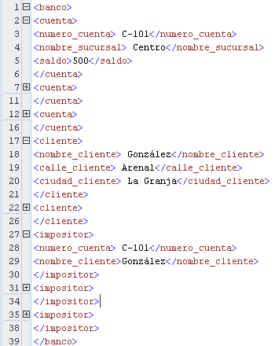{ width=50% text-align=center }

## Ventajas

- Permite que la información esté autodocumentada.

- Formato no rígido pues dispone de la capacidad
de reconocer e ignorar nuevas etiquetas.

- Las etiquetas pueden aparecer varias veces
facilitando la representación de atributos
multivaluados.

- Permite el anidamiento de etiquetas.

## Ejemplo API

- <http://www.thomas-bayer.com/sqlrest/CUSTOMER/>

- <http://www.thomas-bayer.com/sqlrest/CUSTOMER/3/>

# Estructura básica

## Prologo

- Consta de dos declaraciones:

    - La declaración XML que indica **la versión de XML
utilizada y el tipo de codificación de caracteres**.
<?xml version="1.0" encoding="UTF-8"?>

    - La declaración de tipo de documento que asocia el
documento a **una DTD o XSD** respecto a la cual el
documento es conforme.

## Elementos

- Es un par de etiquetas de comienzo y final
coincidentes que delimita una **porción de
información**.

~~~{.xml}
<título>introducción</título>
~~~

## Elementos vacíos

- Existen elementos vacíos que no contienen contenido.

~~~{.xml}
<Nombre etiqueta/>
<Nombre etiqueta></Nombre etiqueta>
~~~

## Elementos anidados

- Los elementos **se pueden anidar**:

    - Un texto aparece en el contexto de un elemento si
aparece entre la etiqueta de inicio y final de dicho
elemento.

    - Las etiquetas se anidan correctamente si toda
etiqueta de inicio tiene un única etiqueta de
finalización coincidente que está en el contexto del
mismo elemento padre.

- Un elemento puede aparecer varias veces en un
documento XML.

## Ejemplo anidado

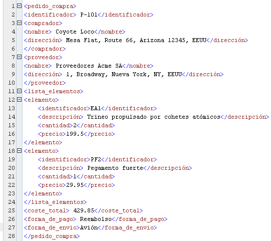{ width=50% text-align=center }

## Atributos

- Las etiquetas de los elementos pueden incluir 1
o más **atributos que representan propiedades**
de los elementos de la forma Nombre
atributo="Valor atributo"

~~~{.xml}
<cuenta tipo_cuenta="corriente">
~~~

- Los atributos pueden aparecer solamente una
vez en una etiqueta dada.

## Mezcla

- El texto en un documento XML puede estar
mezclado con los subelementos de otro
elemento.

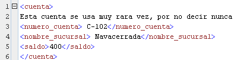{ width=50% text-align=center }

## Raíz

- Todo documento XML tiene **un único elemento
raíz** que engloba al resto de elementos del
documento.

- En el primer ejemplo el elemento <banco> era
la raíz.

## Comentarios

- Es un texto que se escribe **entre <!–- y -->**

- La cadena "--" no puede aparecer dentro de un
comentario.

- Los comentarios pueden aparecer en cualquier
sitio salvo dentro de declaraciones, etiquetas y
dentro de otros comentarios.

## Espacio de nombres

- Es un mecanismo que permite especificar
nombre únicos globalmente para que se usen
como marcas de elementos en los documentos
XML.

- Para ello se antepone a la etiqueta o atributo un
identificador de recursos universal. En el ejemplo
del banco podría ser
http:///www.BancoPrincipal.com

- Para abreviarlo se declaran abreviaturas del
espacio de nombres **mediante el atributo xmlns**

## Ejemplos espacio de nombres

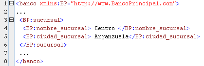{ width=50% text-align=center }

## Varios espacios de nombres

- Un documento puede tener más de un espacio
de nombres declarado como parte del
elemento raíz, de manera que se puede asociar
**elementos diferentes con espacios de nombres
distintos**.

## Espacio de nombre predeterminado

- Se puede definir un **espacio de nombres
predeterminado** mediante el uso del atributo
xmlns en el elemento raíz.

- Los elementos sin un prefijo de espacio de
nombres explícito pertenecen entonces al
espacio de nombres predeterminado.

## CDATA

- A veces es necesario **almacenar valores que
contienen etiquetas sin que se interpreten como
etiquetas XML**, es decir como texto normal. Para
ello se usa la construcción:

~~~{.xml}
<![CDATA]<cuenta>…</cuenta>]]>
~~~

# Procesamiento de XML

## Ejemplo

- Se va a considerar el siguiente documento
XML de ejemplo para ilustrar las diferentes
técnicas de procesamiento.

{ width=50% text-align=center }

## ElementTree

- ElementTree es una **librería estándar para
procesar y crear documentos XML** que crea un
árbol de objetos.

- El árbol generado esta formado por objetos
"elemento" de tipo Element donde cada uno
de ellos dispone de un conjunto de atributos:
nombre, diccionario de atributos, valor textual
y secuencia de elementos hijo.

## Abrir XML

- Para procesar un documento basta abrir el
documento con el **método open()** como si se
tratara de un fichero y usar el método parse
de ElementTree.

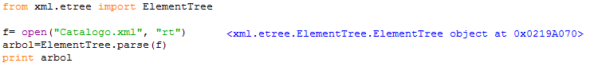{ width=50% text-align=center }

## Iterar XML

- Si se quiere visitar todo el árbol se usa el
**método iter()** que crea un generador que itera
sobre todos los nodos del árbol.

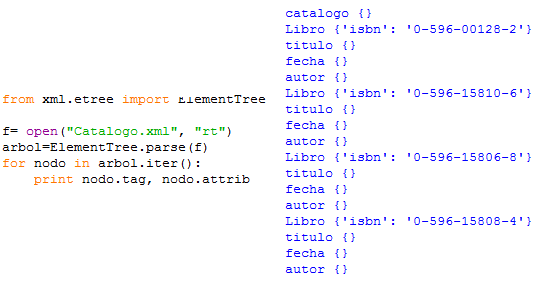{ width=50% text-align=center }

## Filtrar XML

- Puede que se esté interesado sólo en
determinados elementos del árbol, y no en
todos. Para ello **se pasa como parámetro del
método iter() el nombre del elemento de
interés**.

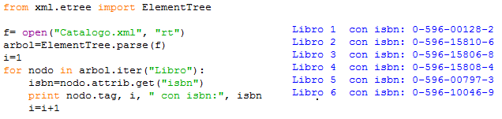{ width=50% text-align=center }

## Iterar desde raíz

- Otra posibilidad de iterar sobre los elementos
del árbol es **acceder a la raíz del árbol y desde
ella iterar** sobre los hijos.

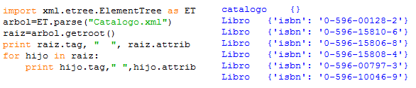{ width=50% text-align=center }

## Acceso indexado

- También es posible acceder a los elementos
**de forma indexada**.

{ width=50% text-align=center }

## Buscar

- **find()**: recupera el primer subelemento del
elemento actual encajando con la descripción
dada
- **findall()**: recupera todos los subelementos del
elemento actual encajando con la descripción
dada
- **iterfind()**: recupera todos los elementos
encajando con la descripción dada.
- **text**: accede al contenido textual de un elemento
- **get(atributo)**: accede al atributo dado del
elemento.

## Ejemplo findAll()

- Se van a encontrar todos los títulos de los
libros **usando findall()**.

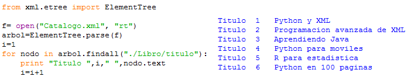{ width=50% text-align=center }

## Uso de eventos

- Se puede realizar un procesamiento basado
en eventos usando el **método iterparse()**:
    - Genera **eventos "start"** en las aperturas de
elemento y **eventos "end"** en los cierres de
elemento.
    - Además los datos pueden ser extraídos del
documento durante la fase de parseo.

## Ejemplo uso eventos

- Ejemplo de parseo dirigido por eventos:

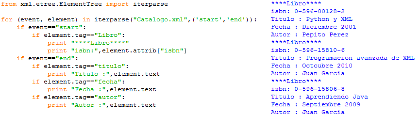{ width=50% text-align=center }

## Desde cadena

- También es posible procesar cadenas que
representan un documento XML usando el
**método fromstring()** que toma como
argumento la cadena que representa el
documento XML.

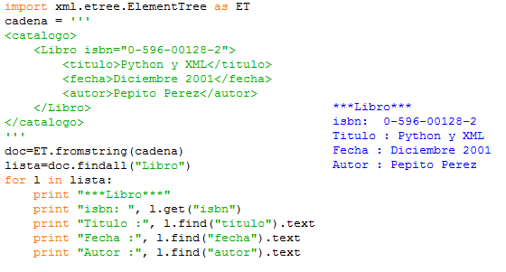{ width=50% text-align=center }

## Modificar XML

- Se puede modificar un documento XML que
ha sido leído:
    - A nivel de elemento se puede cambiar el
contenido cambiando el **valor de Element.text**,
añadir o modificar atributos con el **método
Element.set()**, y añadir nuevos hijos con el
**método Element.append()**.
    - A nivel de documento, se escribe el nuevo
documento con el **método ElementTree.write()**

## Explicar ejemplo modificar XML

- Se va a modificar el documento XML de ejemplo:
    - Se va añadir un nuevo atributo que indica el orden.
    - Se va añadir un nuevo elemento que indica la editorial.
    - Se va añadir un nuevo atributo que indica si hay ejemplares.

## Ejemplo modificar XML

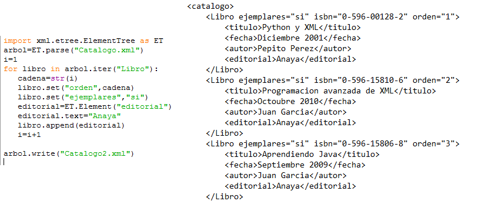{ width=50% text-align=center }

## Eliminar elementos

- También es posible eliminar elementos con el
**método Element.remove()**.

- Tomando como entrada la salida del ejemplo anterior se van a
eliminar todos los elementos de tipo "Libro"
que tengan un número de orden mayor que 3.

## Ejemplo eliminar elementos

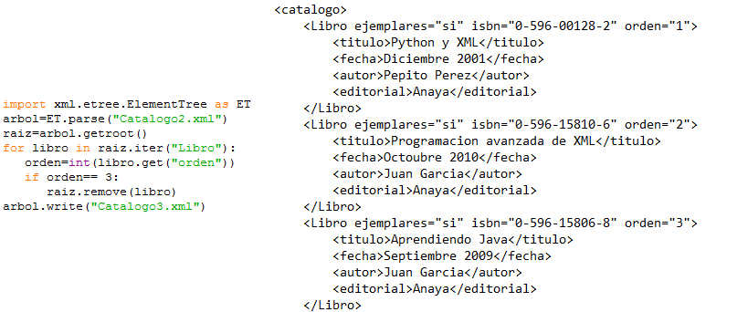{ width=50% text-align=center }

## Crear XML

- También es posible la creación de documentos
XML desde cero. Para ello se disponen de los
siguientes métodos en la clase Element:
    - **Element()**: Crea un elemento nuevo.
    - **subElement()**: Añade un nuevo elemento al padre.

## Ejemplo crear XML

- En el siguiente ejemplo se va a crear un
documento XML con información de un libro
semejante a los ejemplos anteriores.

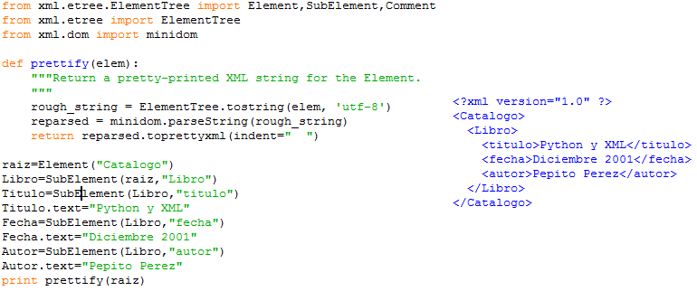{ width=50% text-align=center }

## Añadir atributos

- Para añadir atributos a un elemento que se
está creando basta pasar como argumento del
elemento o subelemento un diccionario con
los atributos expresados en forma de **parejas
clave-valor**.

## Ejemplo añadir atributos

- Se va a modificar el código anterior para
añadir atributos al elemento Libro. En
concreto se va añadir el atributo isbn, orden y
ejemplares.

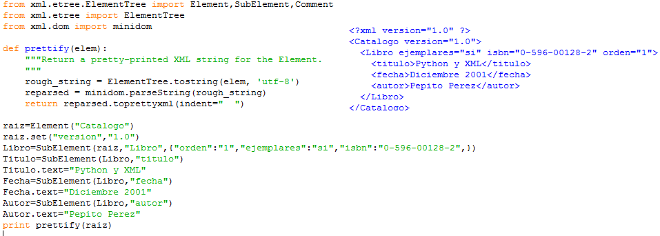{ width=50% text-align=center }

## Añadir hijos

- Se pueden añadir múltiples hijos a un
elemento mediante el **método extend()** que
recibe como argumento algo que sea iterable
tal como una lista o bien otra instancia de
Element.

- En el caso de una instancia de Element, los
hijos del elemento dado se añaden como hijos
del nuevo padre. Sin embargo el padre actual
no es añadido.

## Ejemplo añadir hijos

- Se va a reconstruir el ejemplo anterior pero
usando extend sobre una cadena dada.

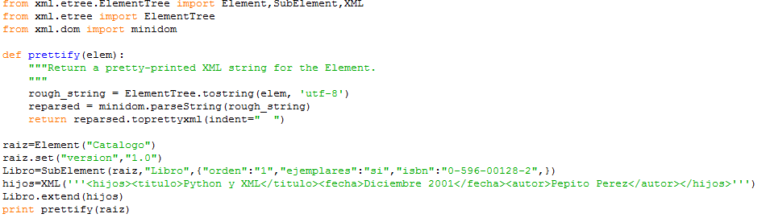{ width=50% text-align=center }

## Ejemplo añadir hijos con lista

- También se podría haber construido
pasando una lista.

{ width=50% text-align=center }

## Guardar XML

- A veces interesa guardar un documento XML
en un archivo. En estos casos se usará el
**método write() de ElementTree**.

## Ejemplo guardar XML

- Se va a realizar el mismo ejemplo de antes
pero ahora el resultado se almacenará en un
archivo.

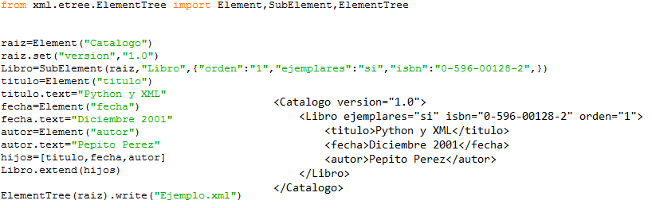{ width=50% text-align=center }

## Elementos vacios

- El método write() de ElementTree tiene un
segundo argumento que sirve para **controlar que
se hace con elementos que son vacíos**. Existen
tres posibilidades según el valor de dicho
argumento:
    - **xml**: Genera un elemento vacío con una sola etiqueta
    - **html**: Genera un elemento vacío con dos etiquetas.
    - **text**: Imprime solo elementos con contenido, el resto
se los salta.

## Ejemplo elementos vacios (I)

- Siguiendo con el ejemplo anterior se va añadir
un elemento vacío y se van a probar los tres
argumentos.

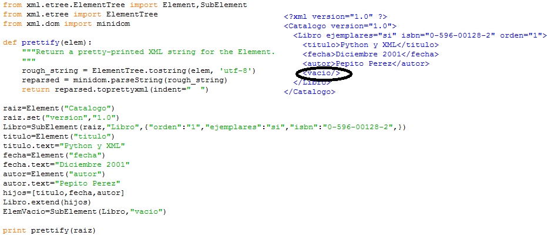{ width=50% text-align=center }

## Ejemplo elementos vacios (II)

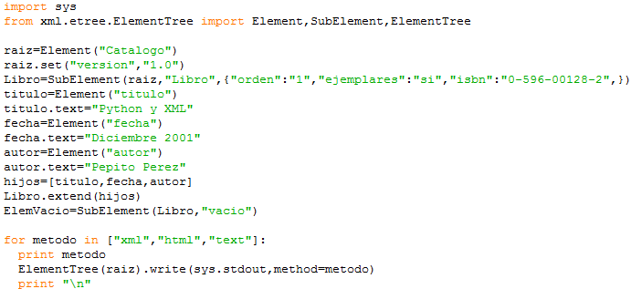{ width=50% text-align=center }

## Ejemplo elementos vacios (III)

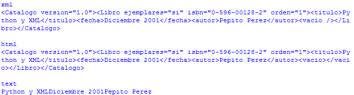{ width=50% text-align=center }

